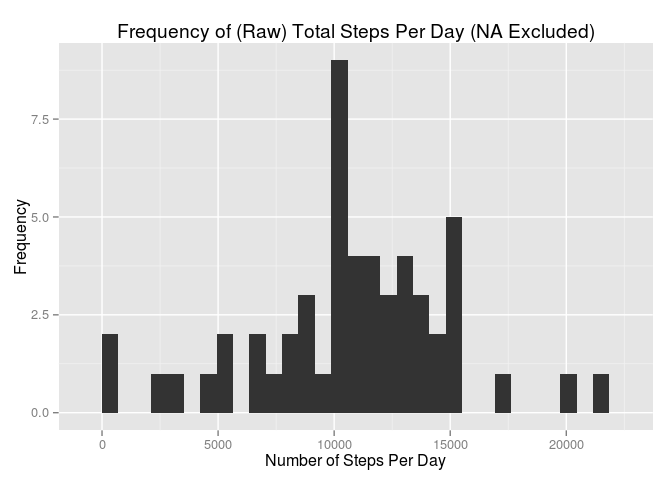
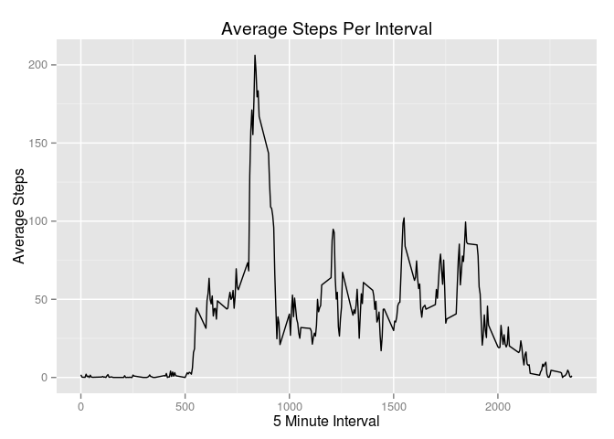
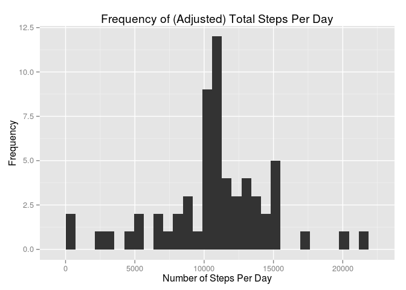
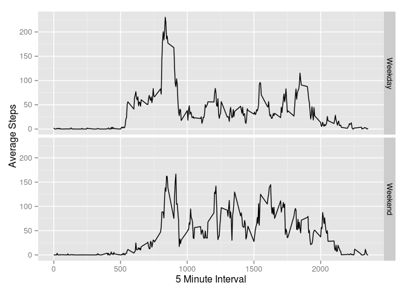

#  PA1_template
Coursera  
13/08/2014  


## Reproducible Research: Peer Assessment 1

* Coursera   : Reproducible Research
* Date       : August 2014
* Project    : 1
* Due        : 17/AUG/2014


## Set Options
I found it necessary to set the following option to get plots written to the figures subdirectory, relative to the working directory.

```r
library(knitr)
opts_chunk$set(fig.path = "./figures/")
```

## Unzip and Read Data

The zip file exists in the local source file directory.  Unzip the file only if the unzipped file does not already exist.  The unzipped file is a csv file which should have 17568 observations.


```r
if(!file.exists('activity.csv')){
    unzip('activity.zip')
}
activity <- read.csv("activity.csv" )    # default for NA is NA

noobs <- nrow(activity)              # number of observations
rowCountIsRight <- "incorrect"       # default to incorrect
if (noobs == 17568) {                # set to correct if correct number of rows
      rowCountIsRight <- "correct"
}
```
After unzipping, the number of observations in the unzipped file is <font color='red'>**17568**</font> which is **correct**.

## What is mean total number of steps taken per day?
For this part of the assignment the missing values (i.e. NA) in the dataset are ignored.  The following histogram plots the frequency of the total number of steps taken each day.  As well, the mean and median of the total number of steps per day is shown.

### Removing NA Values
My initial approach to removing missing values was the following code:-

<code>
    stepsPerDay <- tapply(activity$steps, activity$date, FUN=sum, na.rm=TRUE)
</code>

However, this code seemed to not remove the NA values but replace them with zeroes.  In the resulting histogram, the frequency of days with zero steps was quite high (~10).  A different approach using the aggregate function seemed to work better.


```r
totalstepsperday <-
      aggregate(formula = steps~date, data = activity,
                FUN = sum, na.rm=TRUE)

stepsPerDay <- totalstepsperday$steps
#stepsPerDay <- tapply(activity$steps, activity$date, FUN=sum, na.rm=TRUE)  # did not quite work
```

### Histogram


```r
library(ggplot2)
stepMin <- min(stepsPerDay, na.rm=TRUE)
stepMax <- max(stepsPerDay, na.rm=TRUE)
calcBinWidth <- (stepMax - stepMin) /30  # provide bin width to get rid of warning message

qplot(stepsPerDay,  
      main="Frequency of (Raw) Total Steps Per Day (NA Excluded)",
      xlab="Number of Steps Per Day",
      ylab = "Frequency",
      binwidth=calcBinWidth)  
```

 

### Mean and Median

```r
mean(stepsPerDay)
```

```
## [1] 10766
```

```r
median(stepsPerDay)
```

```
## [1] 10765
```

```r
stepMean <- as.integer(mean(stepsPerDay))     # Assign to var for later reference
stepMedian <- median(stepsPerDay)             # Assign to var for later reference
```
<ul>
<li> The **mean** number of steps taken per day is <font color='red'>**10766.** </font>
<li> The **median** number of steps taken per day day is <font color='red'>**10765.** </font>
</ul>

## What is the average daily activity pattern?
Make a time series plot (i.e. type = "l") of the 5-minute interval (x-axis) and the average number of steps taken, averaged across all days (y-axis).  Which 5-minute interval, on average across all the days in the dataset, contains the maximum number of steps? 

### Time Series Plot
NA values are ignored in the plot.


```r
intervalAverages <- aggregate(x=list(meanSteps=activity$steps), 
                              by=list(interval=activity$interval),
                             FUN=mean, 
                             na.rm=TRUE)
library(ggplot2)

ggplot(data=intervalAverages, 
       aes(x=interval, y=meanSteps)) +
      labs(title="Average Steps Per Interval") +
      geom_line() +
      xlab("5 Minute Interval") +
      ylab("Average Steps")
```

 

### Interval With Maximum
Find the row with the maxiumum mean value and return the **interval**.  The interval is a numeric value which identifies the beginning of the 5 minute interval.  The interval is essentially a time value based on a 24 hour clock.  For instance, 220 is 2:20AM and 1550 is 3:50PM.


```r
intervalAverages[intervalAverages$meanSteps==max(intervalAverages$meanSteps),]
```

```
##     interval meanSteps
## 104      835     206.2
```

```r
rowNr <- which.max(intervalAverages$meanSteps)
HHMM <- intervalAverages[which.max(intervalAverages$meanSteps),'interval'] 
MaxAvg <- intervalAverages[which.max(intervalAverages$meanSteps),'meanSteps'] 

Hr <- HHMM%/%100
Mn <- HHMM%%100


formattedInterval <- paste(Hr, ":", Mn,  sep = "")
```

The 5 minute interval with the maximum average steps was found at row <font color='red'>**104**</font>, and this interval begins at <font color='red'>**8:35**</font>.  The maximum mean value was <font color='red'>**206.1698** </font>.


## Imputing missing values
There are a number of days/intervals where there are missing values (coded as NA). The presence of missing days may introduce bias into some calculations or summaries of the data. The requirements for this step are:-

* **Count Missing**: Calculate and report the total number of missing values in the dataset (i.e. the total number of rows with NAs)
* **Strategy**: Devise a strategy for filling in all of the missing values in the dataset. The strategy does not need to be sophisticated. For example, you could use the mean/median for that day, or the mean for that 5-minute interval, etc.
* **Imputed Dataset**: Create a new dataset that is equal to the original dataset but with the missing data filled in.
* **Histogram**: Make a histogram of the total number of steps taken each day and calculate and report the mean and median total number of steps taken per day. Do these values differ from the estimates from the first part of the assignment? What is the impact of imputing missing data on the estimates of the total daily number of steps?


### Number of Rows With Missing Values
Identify the rows with missing (NA) values for *steps* then count them.


```r
nrow(activity[is.na(activity$steps),])
```

```
## [1] 2304
```

```r
numberRowsWithNA <- nrow(activity[is.na(activity$steps),])
```
There are  <font color='red'>**2304**</font> rows with missing (*NA*) values for *steps*.

### Devise a strategy for filling in all of the missing values in the dataset.
The simple approach adopted here will be to use the mean of each 5 minute interval to fill in missing values.  The following section implements this strategy.

### Create a New Dataset, Filling In Missing Values
The dataframe **activity** is the original dataframe with missing values.  The dataframe **intervalAverages** has means for each interval but with *NA* values removed.  The **intervalAverages** has all the intervals as demonstrated by the following code.  


```r
numberOfIntervalMeans <- nrow(intervalAverages)  # means for intervals with non-missing values
numberOfIntervals <- 24 * 12                     # 24 hours and 12 by 5-minute intervals per hour
```

There is a mean value for every interval as **intervalAverages** has <font color='red'>**288**</font> rows which is the same as the number of intervals in a day (<font color='red'>**288**</font>).
 
Merge the two dataframes replacing any *NA* values with the mean for that interval.  As proven above, there will be no complications caused by any particular interval having missing values over all observations.  After the merge, the new dataframe **mergeActivity** will have the **meanSteps** attribute added.  A second step will selectively replace any NA values for **steps** with **meanSteps**.  When NA values are replaced by the mean, they are rounded.  This means that some intervals with a mean less than 0.5 will be rounded down to zero.  A final step will remove the **meanSteps** attribute.


```r
mergeActivity <- merge(activity, intervalAverages,  # join the two dataframes
                       by = 'interval',             # join on interval
                       all = FALSE)                 # inner join


mergeActivity$steps[is.na(mergeActivity$steps)] <-
      round(mergeActivity$meanSteps[is.na(mergeActivity$steps)])   

mergeActivity <- mergeActivity[names(activity)]     # drop any columns not in "activity"
```
 
 
### Histogram of Steps Per Day, Mean and Median
<ul>
<li>Calculate the total steps per day
</ul>


```r
imputedStepsDay <- tapply(mergeActivity$steps,
                        mergeActivity$date, sum)
```
<ul>
<li>Produce a histogram of the frequency of the total steps per day using the *imputed* or *filled in* dataset.
</ul>


```r
qplot(imputedStepsDay,  
      main="Frequency of (Adjusted) Total Steps Per Day",
      xlab="Number of Steps Per Day",
      ylab = "Frequency",
      binwidth=calcBinWidth)                  # Calculated above
```

 
<ul>
<li>Finally, calculate the mean and median values.  The values for the original and imputed dataset are calculated.
</ul>


```r
mean(stepsPerDay)            # Original Mean
```

```
## [1] 10766
```

```r
mean(imputedStepsDay)        # Imputed Mean
```

```
## [1] 10766
```

```r
median(stepsPerDay)          # Original Median
```

```
## [1] 10765
```

```r
median(imputedStepsDay)      # Imputed Median
```

```
## [1] 10762
```

```r
imputedMean   <- as.integer(mean(imputedStepsDay))    # Imputed Mean
imputedMedian <- as.integer(median(imputedStepsDay))  # Imputed Median
```

#### Do these values differ from the estimates from the first part of the assignment? 
The values do differ slightly from the estimates in the first part of the assignment.
<ul>
<li> **Mean** has changed from <font color='red'>**10766** </font> to <font color='red'>**10765** </font>.
<li> **Median** has changed from <font color='red'>**10765** </font> to <font color='red'>**10762** </font>.
</ul>

This is due to NA values being replaced by **mean** values.  The increased number of observations with the old mean therefore lower the mean and median in the imputed set of data.

#### What is the impact of imputing missing data on the estimates of the total daily number of steps?
Imputing the missing data has increased the frequency around the mean.  The were about 7 whole days of missing observations.  By imputing the values for these days with mean values the peak around the middle of the histogram has increased.

In contrast to my previous approach using **tapply**, the frequency of days with zero steps remains the same.

## Are there differences in activity patterns between weekdays and weekends?
Use the dataset with the filled-in missing values for this part.  The processing steps are:-

<ul>
<li>Convert the attribute **date** to a date datatype.
<li>Add a derived attribute **wend** which takes the value **Weekend** or **Weekday** depending on the weekday name.
</ul>


```r
mergeActivity$date <- as.Date(mergeActivity$date)
mergeActivity$wend <- as.factor(ifelse(weekdays( mergeActivity$date) %in% c("Saturday","Sunday"), "Weekend", "Weekday")) 
```
<ul>
<li>Calculate the mean by interval and Weekday/Weekend.
</ul>


```r
averages <- aggregate(steps ~ interval + wend, data=mergeActivity, mean)
```
<ul>
<li>Finally, produce a plot of average number of steps taken on weekdays and weekends.
</ul>


```r
ggplot(averages, aes(interval, steps)) + geom_line() + facet_grid(wend ~ .) +
xlab("5 Minute Interval") + ylab("Average Steps")
```

 

There are differences between weekdays and weekends.
<ul>
<li> **Weekdays**: There is a sudden rush of activity just after 5am and peak over 200 steps is reached about 8am to 9am.  This peak trails off around 10am.  Later in the day, there are a few peaks of about 100 steps.
<li> **Weekends**: Activity commences around the same time as weekdays, but the build up to the peak at 8am to 9am is more gradual, and the peak is not as high (~150 steps).  In contrast to a weekday, there is more activity through out the day.
</ul>

